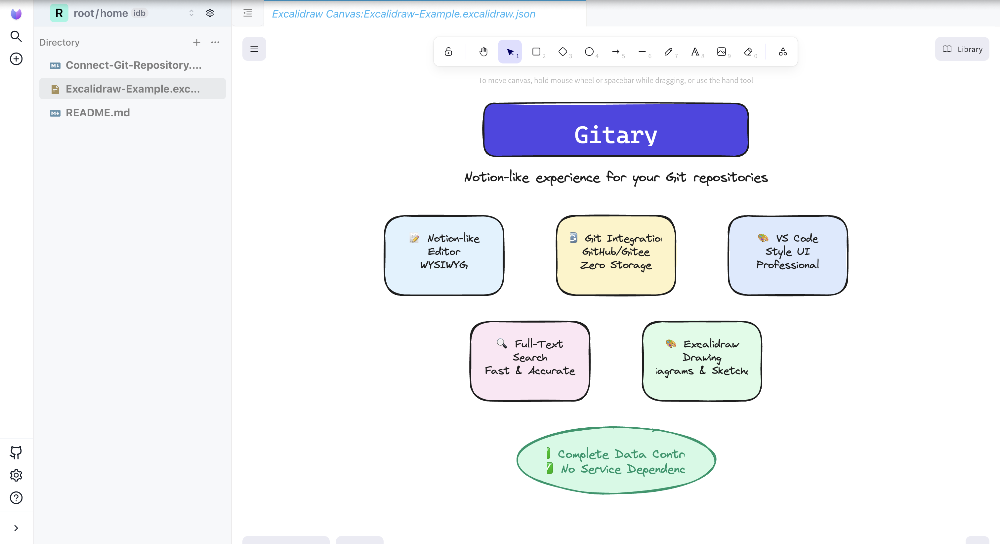
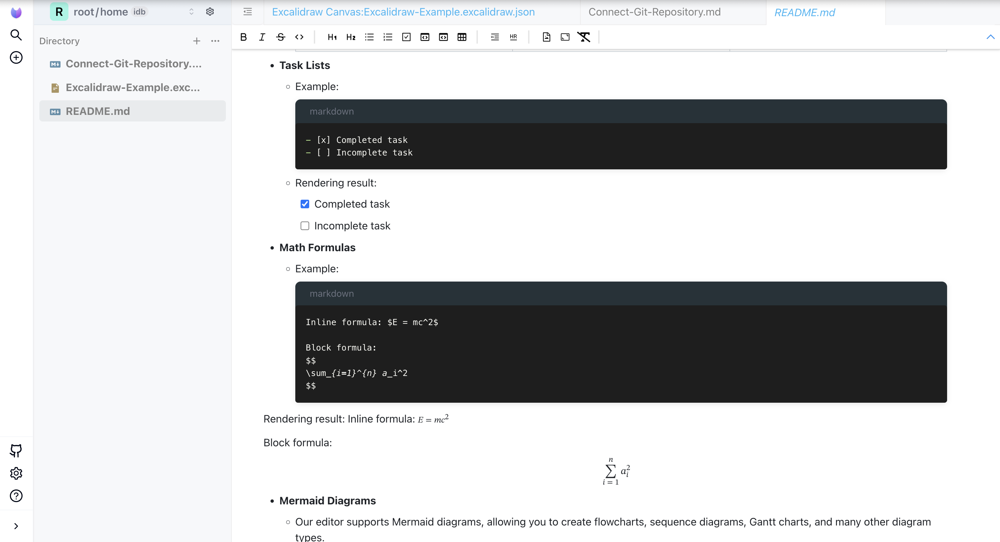

# Gitary

[English](README.md) | [中文](README.zh-CN.md)

> **类 Notion 编辑 + Excalidraw 画图，运行在你的 Git 仓库上**  
> **为你的 Git 仓库带来 Notion 风格的强大编辑体验和 Excalidraw 画图能力**

将 Notion 风格的强大编辑体验和 Excalidraw 画图能力带到你的 Git 仓库中。你的笔记，你的数据，你的控制权。

## 🌐 在线体验

**[在线体验 Gitary →](https://gitary.app/)**

## 🔌 浏览器扩展

**Gitary Companion** - 一键在 Gitary 中打开 GitHub、Gitee、GitCode 仓库！

- **[从 Chrome Web Store 安装 →](https://chromewebstore.google.com/detail/gitary-companion/halhhaelcfghngkpkikcnlcjbmlkgjed)**
- 在仓库页面（GitHub/Gitee/GitCode）点击扩展图标，即可在 Gitary 中打开对应仓库
- 在仓库页面或链接上右键，选择「在 Gitary 中打开此仓库」
- 支持 **GitHub**、**Gitee** 和 **GitCode** 平台

更多详情，请查看 [Gitary Companion 说明文档](browser-extension/gitary-companion/README.zh-CN.md)。

## 📸 截图展示

<div align="center">
  
  <p><em>Excalidraw 画图支持 - 创建精美的图表和草图</em></p>
</div>

<div align="center">
  
  <p><em>类 Notion 的 Markdown 编辑器，支持实时预览</em></p>
</div>

## 🎯 为什么选择 Gitary？

**类 Notion 体验 + Git 的数据所有权 = 完美的知识管理方案**

- ✅ **熟悉的编辑体验**：类 Notion 风格的优雅 Markdown 编辑器，所见即所得
- ✅ **完全的数据控制**：笔记直接存储在你的 **GitHub/Gitee/GitCode** 仓库中
- ✅ **强大的版本管理**：利用 Git 的完整能力，追踪每一次修改
- ✅ **无服务依赖**：即使 Gitary 停止服务，你的笔记依然在你的 Git 仓库中

## 🚀 核心特性

### 📝 类 Notion 编辑体验

- 所见即所得的 Markdown 编辑器
- Slash commands 快速格式化
- 支持数学公式、图表、代码高亮
- 直观优雅的写作体验

### 🔄 运行在你的 Git 仓库上

- 直接连接 **GitHub**、**Gitee**、**GitCode** 仓库
- **零中间存储**：笔记直接写入你的仓库，不经过任何第三方服务器
- 完整的 Git 操作：提交、分支、合并、历史查看
- 支持多个 Git 托管平台

### 🎨 VS Code 风格的工作环境

- 熟悉的侧边栏、编辑器、面板布局
- 可自定义的工作区
- 专业的开发环境，适合技术文档写作

### 📂 强大的代码阅读能力

- 打开和查看代码文件，语法高亮显示
- 比传统 Git 客户端更好的仓库浏览体验
- 轻松浏览你的代码库

### 🔍 全文检索

- 强大的全文检索功能，搜索所有笔记和文件
- 快速准确的搜索结果
- 支持在代码文件和 Markdown 文档中搜索

### 🎨 Excalidraw 画图支持

- 内置 **Excalidraw** 白板，创建图表和草图
- 绘制流程图、架构图、线框图等
- 所有绘图直接保存到你的 Git 仓库
- 专业的绘图工具，支持形状、箭头和文本
- 完美适合技术文档和可视化笔记

## 🆚 Gitary vs Notion

| 特性 | Notion | Gitary |
|------|--------|--------|
| **编辑体验** | ✅ 优秀 | ✅ 类 Notion，同样优秀 |
| **数据存储** | ❌ Notion 服务器 | ✅ **你的 Git 仓库** |
| **数据所有权** | ❌ 不完全拥有 | ✅ **完全拥有** |
| **版本控制** | ⚠️ 仅历史记录 | ✅ **完整 Git 能力** |
| **服务依赖** | ❌ 依赖 Notion | ✅ **无依赖，数据在 Git** |
| **跨平台同步** | ✅ 自动 | ✅ **Git 自动同步** |
| **代码仓库集成** | ❌ 不支持 | ✅ **原生支持** |
| **成本** | 💰 付费计划 | ✅ **免费（使用你的 Git 仓库）** |

## 💡 适用场景

- 👨‍💻 **开发者**：像管理代码一样管理技术笔记，利用 Git 的版本控制能力
- 📚 **技术写作者**：将文档直接存储在代码仓库，与项目代码一起管理
- 🎓 **学习者**：通过 Git 历史追踪学习进度，建立知识体系
- 🏢 **团队协作**：通过 Git 的协作能力，实现团队知识共享

## 🚀 快速开始

```shell
pnpm i
pnpm dev
```

访问 http://localhost:5173/

## 📖 文档

更多信息，请访问我们的[文档](https://gitary.app/)。

## 🤝 贡献

欢迎贡献！请随时提交 Pull Request。

## 📄 许可证

本项目采用 [MIT 许可证](LICENSE)。

---

**Gitary** - 类 Notion 编辑 + Excalidraw 画图，运行在你的 Git 仓库上。你的笔记，你的数据，你的控制权。
